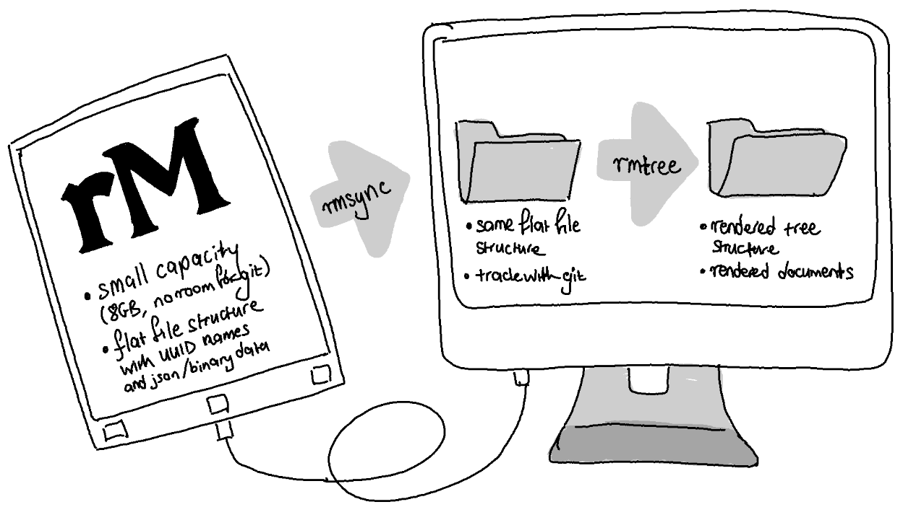

Managing reMarkable tablet, old school
======================================

I manage much of my life with the reMarkable paper tablet. When I'm not on
paper, I'm at home in a terminal emulator trying to practice the unix
philosophy. I have no time for gratuitous cloud connections and integrations.
If you're like me, you might appreciate this repository.

Within is family of tools I am gathering and building to manage a local
repository of all of my notebooks and annotations from the reMarkable tablet,
without reliance on the official reMarkable cloud or integrations.

The basic tools are currently under construction. A more comprehensive set
of tools is under design (including for loading and unloading PDFs).
Feedback and suggestions are welcome.

Overview
--------

TODO (build):

* `rmsync`: Backup and version control notebooks and annotations, but on a
  companion computer with more storage than the tablet itself. This tool
  uses `rsync` to efficiently mirror the flat file structure from the tablet
  to the computer over USB, and checks the structure into git (except pdfs?).

* `rmtree`: Render reMarkable flat directory of binary `.lines` files with a
  sane folder structure plus lightweight pdf and svg files (todo: png? txt?).

Installation
------------

On the tablet:

* Install reMarkable Entware (https://github.com/Evidlo/remarkable_entware)
* Install `rsync` (todo)

> Note: Default install method of Entware and `rsync` requires the device be
> connected to the network. This which will trigger a sync if cloud services
> are set up.
> But, `rem` tools are designed not to interfere with automatic cloud sync,
> and run offline aside from this installation step.

On the computer:

* rmsync:
  * Install `rsync` and, optionally, `git`?
  * Install the `rmsync` script from this repository (to path?)
  * Configure (how?)
* rmtree:
  * Install the script (python + dependenies or something?)
  * Install the converters (binaries build from C src or something?)
* ...

Workflows
---------

Things I want to do with the reMarkable, and how to do them with `rem` (or
other tools).

1.  Share my reMarkable screen
    (with [rmview](https://github.com/bordaigorl/rmview))

    * Start screen sharing on device (:( update added an extra step...!)
    * Open a terminal (or dmenu?) and run `rmview`
    * 'Share screen' with whatever communications app I am using

2.  Backup notes and annotations locally, without the reMarkable cloud

    * Connect reMarkable via USB cable
    * Open a terminal (or dmenu) and (navigate to folder and?) run `rmsync`

3.  Version control notes and annotations

    * Connect reMarkable via USB cable
    * Open a terminal (or dmenu) and (navigate to repo and?) run `rmsync`
    * `git commit -a -m 'message'`, etc.

4.  Automatically sync on connect?

Links
-----

Other cool reMarkable projects:

* single-command interface for rmsync and rmtree inspired by the stunningly
  streamlined [rmview](https://github.com/bordaigorl/rmview)
* rmtree uses a .lines parser built with
  [reMarkable-kaitai](https://github.com/matomatical/reMarkable-kaitai)
* for more awesome remarkable projects, check out
  [awesome-reMarkable](https://github.com/reHackable/awesome-reMarkable)
* this repository is not affiliated with reMarkable AS

Under design
------------

Tools:

* `rmload`---a streamlined way to load new files to the device in bulk, with
  folder structure; and to leverage storage space by *unloading* large files
  from the device when not in use.

* a tool to create and sync custom splash screens and templates.

Workflows:

5.  Share a directory of notes with others (meeting notes, etc.)

    ? rmsync, rmtree, update a public git/website sourced from svg/pdf files
    in the resulting tree? can a git repo persist in the generated tree?

6.  Load new papers or some files to the tablet

    ? cd to the files/folders and then a command to load them?
    can it somehow be even simpler, a command integrated into a file
    manager? just drop them in a folder?

7.  Unload unused files from the tablet

8.  Load splash screens and templates after an update
